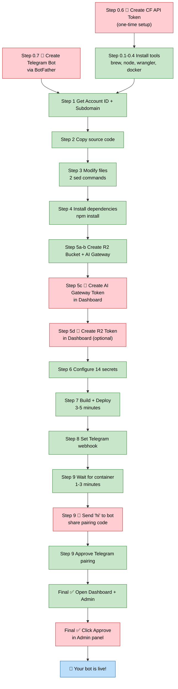
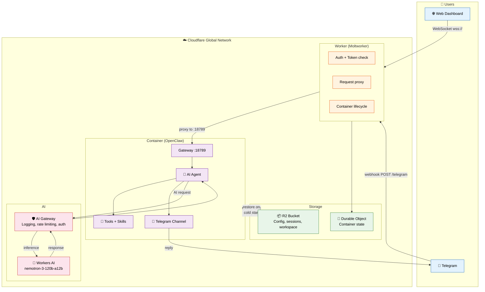

# Deploy OpenClaw

## What is this?

An **AI Skill** that automatically deploys an [OpenClaw](https://github.com/openclaw/openclaw) AI Bot on [Cloudflare](https://cloudflare.com).

OpenClaw is an open-source AI agent that runs on Cloudflare's edge network. This skill packages everything needed to go from zero to a working AI bot — including infrastructure setup, deployment, and Telegram integration.

The key file is **`SKILL.md`** — a detailed instruction set designed for AI agents (Claude Code, Claude Desktop, OpenClaw) to read and execute autonomously.

## What can it do?

- **Deploy a Telegram AI Bot** — chat with your own AI assistant in Telegram
- **Set up a Web Dashboard** — monitor and control your bot from a browser
- **Auto-install everything** — Node.js, Docker, wrangler CLI, all from scratch
- **Auto-create cloud resources** — R2 storage, AI Gateway, Worker, Container
- **Auto-configure 14 secrets** — API keys, tokens, environment variables
- **Auto-pair Telegram** — connect your bot to Telegram with pairing approval
- **Persist data** — conversations, config, and skills survive container restarts via R2 sync
- **Run on Cloudflare's edge** — low latency, global availability, serverless scaling

## Who is this for?

Anyone who wants their own AI bot but doesn't want to deal with infrastructure. You don't need to know how to code, use a terminal, or understand cloud services. Just talk to your AI agent and it handles the rest.

## How it works

```
You:  "Deploy a new AI bot for me"
AI:   Installing tools... creating resources... deploying...
AI:   "Done! Send 'hi' to your bot on Telegram."
You:  "hi"
Bot:  "Hey! I'm your new AI assistant. How can I help?"
```

The AI reads `SKILL.md` and follows 10 steps:

| Step | What happens | Who does it |
|------|-------------|-------------|
| 0 | Check & install prerequisites | AI (auto-fix) |
| 1 | Get Cloudflare account info | AI |
| 2 | Copy source code | AI |
| 3 | Modify config (2 sed commands) | AI |
| 4 | Install dependencies | AI |
| 5 | Create cloud resources | AI + You (tokens) |
| 6 | Configure 14 secrets | AI |
| 7 | Build & deploy | AI |
| 8 | Set up Telegram webhook | AI |
| 9 | Pair Telegram + Dashboard | AI + You |

## What you need

- A **Mac** (macOS)
- A **Cloudflare account** with [Workers Paid Plan](https://dash.cloudflare.com/) ($5/month)
- **Telegram** installed on your phone or desktop

That's it. The AI installs everything else.

## Deployment flow



| | Count | What |
|---|---|---|
| 🔴 **You do** | 6 steps | Create tokens, send "hi", click Approve |
| 🟢 **AI does** | 11 steps | Install, build, deploy, configure, everything else |

## Architecture



## What gets created on Cloudflare

| Resource | Name | Purpose |
|----------|------|---------|
| Worker | `{name}.{subdomain}.workers.dev` | Entry point — handles auth, routing, container lifecycle |
| Container | (auto-created) | Runs the OpenClaw AI agent |
| AI Gateway | `{name}-gateway` | Logs AI requests, rate limiting, authentication |
| R2 Bucket | `{name}-data` | Persists config, sessions, workspace across restarts |
| Secrets | 14 total | API keys, tokens, URLs, feature flags |

## Quick start

### As an OpenClaw Skill

Copy this folder to your OpenClaw skills directory. Then ask your agent:

> "Deploy a new OpenClaw bot"

### With Claude Code or Claude Desktop

Point the AI to `SKILL.md` and say:

> "Follow the instructions in SKILL.md to deploy a new OpenClaw bot"

### Manual

Read `SKILL.md` for the complete step-by-step commands. Every command is documented — you can run them yourself if needed.

## File structure

```
deploy-openclaw/
├── SKILL.md              ← Instructions for the AI agent (the brain)
├── README.md             ← You are here
└── moltworker/           ← Pre-configured source code (no git clone needed)
    ├── Dockerfile        ← Container: Node 22.16.0 + OpenClaw 2026.3.13
    ├── start-openclaw.sh ← Container startup: onboard + config patch + gateway
    ├── wrangler.jsonc    ← Worker + Container + R2 bindings
    ├── package.json      ← Dependencies
    ├── src/              ← Worker source code (TypeScript)
    ├── skills/           ← Built-in skills (browser automation)
    └── public/           ← Dashboard UI assets (logos)
```

## Key concepts

| Term | What it is |
|------|-----------|
| **OpenClaw** | Open-source AI agent — handles conversations, tools, memory |
| **Moltworker** | Cloudflare Worker that wraps OpenClaw in a container |
| **Worker** | Lightweight JavaScript at the edge — the "front door" |
| **Container** | Full Linux environment — where OpenClaw actually runs |
| **AI Gateway** | Cloudflare proxy for AI requests — adds logging and protection |
| **R2** | Cloudflare object storage — keeps your data when container sleeps |
| **SKILL.md** | Instructions file that AI agents read and execute |

## Versions

| Component | Version |
|-----------|---------|
| OpenClaw | 2026.3.13 |
| Node.js (in container) | 22.16.0 |
| Moltworker | Snapshot 2026-03-25 |
| Container size | standard-2 (2 vCPU, 4GB RAM) |

## Updating

1. Clone latest [cloudflare/moltworker](https://github.com/cloudflare/moltworker)
2. Copy files into `moltworker/` (keep current structure)
3. Re-apply modifications to `start-openclaw.sh` (auth order + allowedOrigins)
4. Update versions in `Dockerfile` if needed
5. Test deploy, then commit + push

## License

Moltworker source code is from [cloudflare/moltworker](https://github.com/cloudflare/moltworker) under its original license.
