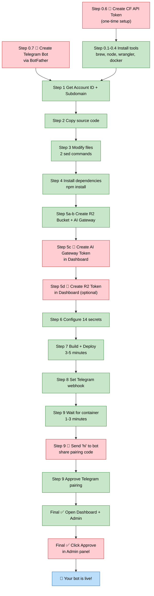

# Deploy OpenClaw

Deploy [OpenClaw](https://github.com/openclaw/openclaw) AI Bot on Cloudflare — fully automated by AI.

> Tell your AI agent _"Deploy a new AI bot for me"_ and it handles everything.

## How it works

This is an **AI Skill** — a set of instructions that AI agents (Claude Code, Claude Desktop, OpenClaw) read and execute. The AI does the heavy lifting; you just answer a few questions.

```
You:  "Deploy a new AI bot for me"
AI:   Installing tools... creating resources... deploying...
AI:   "Done! Send 'hi' to your bot on Telegram."
You:  "hi"
Bot:  "Hey! I'm your new AI assistant. How can I help?"
```

## What you need

- A Mac
- A Cloudflare account ([Workers Paid Plan](https://dash.cloudflare.com/) — $5/month)
- [Telegram](https://telegram.org/) installed

That's it. The AI installs everything else (Node.js, Docker, wrangler CLI).

## What you'll do vs what the AI does



| | Count | Examples |
|---|---|---|
| 🔴 **You do** | 6 steps | Create tokens, send "hi", click Approve |
| 🟢 **AI does** | 11 steps | Install, build, deploy, configure |

## What gets created

```
Telegram / Web Dashboard
        ↓
┌─────────────────────────┐
│  Worker (Moltworker)    │  ← Cloudflare Workers
│  Routing + Auth         │
└───────────┬─────────────┘
            ↓
┌─────────────────────────┐
│  Container (OpenClaw)   │  ← Cloudflare Containers
│  AI Agent + Tools       │
└───────────┬─────────────┘
            ↓
┌─────────────────────────┐
│  AI Gateway             │  ← Cloudflare AI Gateway
│  Logging + Protection   │
└───────────┬─────────────┘
            ↓
      Workers AI Model
   (nemotron-3-120b-a12b)
```

| Resource | Name | Purpose |
|----------|------|---------|
| Worker | `{name}.{subdomain}.workers.dev` | Entry point, auth, routing |
| Container | (auto-created) | Runs the AI agent |
| AI Gateway | `{name}-gateway` | Logs, rate limits AI requests |
| R2 Bucket | `{name}-data` | Persists data across restarts |
| Secrets | 14 total | API keys, tokens, config |

## Quick start

### Option 1: As an OpenClaw Skill

Copy this folder to your OpenClaw skills directory. Then ask your agent:

> "Deploy a new OpenClaw bot"

### Option 2: With Claude Code or Claude Desktop

Point the AI to `SKILL.md` and say:

> "Follow the instructions in SKILL.md to deploy a new OpenClaw bot"

### Option 3: Manual

Read `SKILL.md` for the complete step-by-step commands.

## File structure

```
deploy-openclaw/
├── SKILL.md              ← Instructions for the AI agent
├── README.md             ← You are here
└── moltworker/           ← Pre-configured source code
    ├── Dockerfile        ← Container image definition
    ├── start-openclaw.sh ← Startup script + config
    ├── wrangler.jsonc    ← Worker + Container settings
    ├── package.json      ← Dependencies
    ├── src/              ← Worker code (TypeScript)
    ├── skills/           ← Built-in skills
    └── public/           ← Dashboard UI assets
```

## Versions

| Component | Version |
|-----------|---------|
| OpenClaw | 2026.3.13 |
| Node.js (in container) | 22.16.0 |
| Moltworker | Snapshot 2026-03-25 |
| Container size | standard-2 (2 vCPU, 4GB RAM) |

## Updating

1. Clone latest [cloudflare/moltworker](https://github.com/cloudflare/moltworker)
2. Copy files into `moltworker/` (keep current structure)
3. Re-apply modifications to `start-openclaw.sh` (auth order + allowedOrigins)
4. Update versions in `Dockerfile` if needed
5. Test deploy, then commit + push

## License

Moltworker source code is from [cloudflare/moltworker](https://github.com/cloudflare/moltworker) under its original license.
